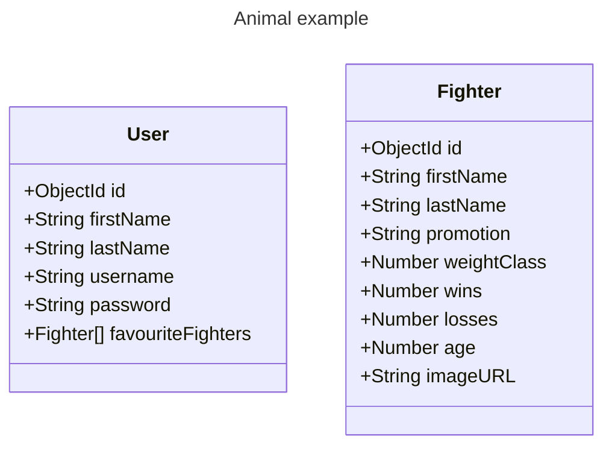

### Database

Using MongoDB Atlas first

### Models

```mermaid
---
title: Animal example
---
classDiagram
    class User{
        +ObjectId id
        +String firstName
        +String lastName
        +String username
        +String password
        +Fighter[] favouriteFighters
    }
    class Fighter{
        +ObjectId id
        +String firstName
        +String lastName
        +String promotion
        +Number weightClass
        +Number wins
        +Number losses
        +Number age
        +String imageURL
    }
```
